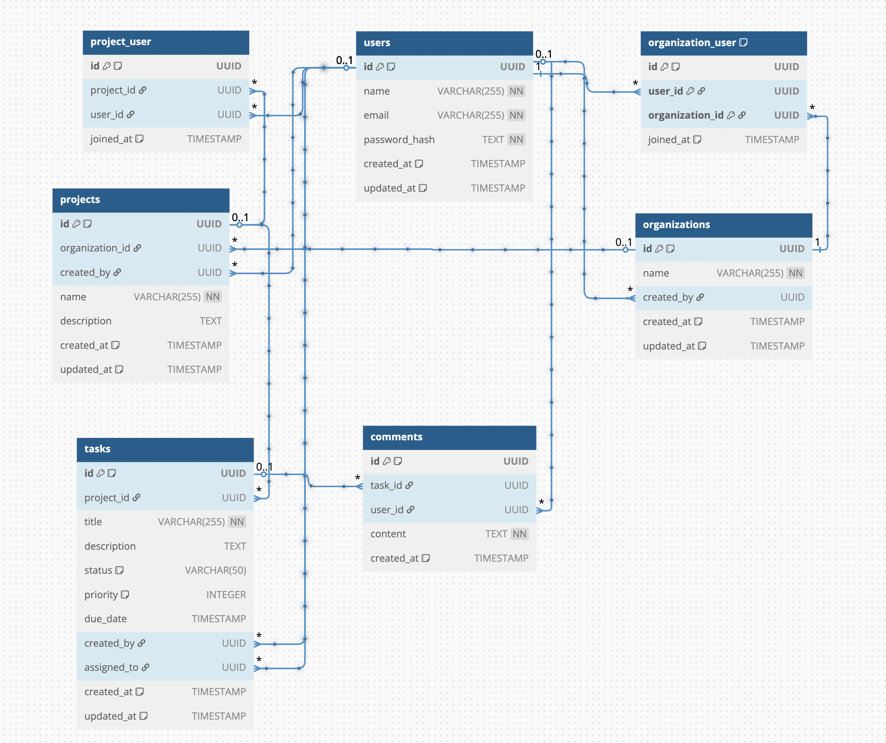

# Jira Clone

A robust API-based project management system inspired by Jira, built with Node.js, Express, TypeORM, and PostgreSQL.

## Project Overview

This project is a Jira-like application that provides APIs for managing software development workflows. It includes the following core features:

- **Authentication & Authorization**: Secure login, registration, and JWT-based authentication
- **Organizations**: Create and manage organizations
- **Projects**: Create and manage projects within organizations
- **Tasks**: Create, assign, update, and track tasks with various properties (status, priority, etc.)
- **Users**: User management and role-based permissions
- **Comments**: Add comments to tasks for better collaboration

## API Endpoints

The API includes the following main endpoints:

- **Authentication**: `/api/v1/auth` (register, login)
- **Organizations**: `/api/v1/organizations` (CRUD operations)
- **Organization Users**: `/api/v1/organizations-users` (manage users in organizations)
- **Projects**: `/api/v1/projects` (CRUD operations)
- **Project Users**: `/api/v1/projects-users` (manage users in projects)
- **Tasks**: `/api/v1/tasks` (CRUD operations)
- **Comments**: `/api/v1/comments` (CRUD operations)

For detailed API documentation, visit the Swagger UI at http://localhost:4000/api/v1/api-docs when the application is running.

## Entity Relational Diagram

- [Documentation with details plan mentioned in the video](https://www.notion.so/Subscript-technical-test-17665834810d8088a145c3e63757a35f)



## Tech Stack

### Backend

- Node.js & Express.js - API framework
- TypeScript - Type safety and better developer experience
- TypeORM - ORM for database operations
- PostgreSQL - Relational database
- JSON Web Tokens (JWT) - Authentication
- Zod - Schema validation
- Jest - Testing framework
- Swagger - API documentation

### DevOps

- Docker & Docker Compose - Containerization

## Architecture Patterns

This project implements several architectural patterns to ensure maintainability, testability, and scalability:

### Modular Pattern

The codebase is organized into feature modules (auth, organizations, projects, tasks, etc.), each containing its own:

- Controllers: Handle HTTP requests and responses
- Services: Implement business logic
- Repositories: Manage data access
- Routes: Define API endpoints
- Entities: Define data models
- DTOs: Define data transfer objects

This modular approach:

- Keeps related code together
- Makes the codebase easier to navigate
- Enables independent development of features
- Simplifies maintenance and testing

### Dependency Injection Pattern

Using the TypeDI library, dependencies are injected rather than hardcoded:

- Services are injected into controllers
- Repositories are injected into services
- Configuration is injected where needed

Benefits include:

- Loose coupling between components
- Easier unit testing through mocking
- More flexible code that's easy to extend
- Cleaner implementation of the Single Responsibility Principle

### Repository Pattern

Data access is abstracted through repositories:

- Each entity has its own repository
- Repositories handle all database operations
- Business logic is kept separate from data access
- TypeORM is used to implement the repositories

This pattern provides:

- A clean separation between business logic and data access
- Consistent data access methods
- The ability to switch database technologies with minimal impact
- Simplified testing with mock repositories

## Prerequisites

Before you begin, ensure you have the following installed:

- Node.js (v18 or later)
- npm or yarn
- Docker and Docker Compose
- Git

## Getting Started

### Installation

1. Clone the repository:

   ```
   git clone https://github.com/DaiThanh97/jira.git
   cd jira
   ```

2. Install dependencies:
   ```
   npm install
   ```

### Environment Setup

1. Create a `.env` file in the root directory (or use the existing one):

   ```
   PORT = 4000
   BASE_PATH=/api/v1

   DB_HOST=localhost
   DB_PORT=5432
   DB_USERNAME=root
   DB_PASSWORD=123123
   DB_NAME=todo

   JWT_SECRET_KEY=secret-key
   JWT_DURATION=10h
   ```

   You can modify these values as needed.

### Running the Application

#### Development Mode

1. Start the PostgreSQL database:

   ```
   docker-compose up app_postgres -d
   ```

2. Run the application in development mode:

   ```
   npm run dev
   ```

   This starts the application with nodemon for automatic reloading on code changes.

3. The API will be available at: http://localhost:4000/api/v1
4. Swagger API documentation: http://localhost:4000/api/v1/api-docs

## Testing

Run the test suite:

```
npm test
```

Run tests in watch mode:

```
npm run test:watch
```

## Building for Production

Build the TypeScript code:

```
npm run build
```

Run the production build:

```
npm start
```

## Project Structure

```
.
├── src/
│   ├── common/           # Common utilities and shared code
│   ├── configs/          # Application configuration
│   ├── middlewares/      # Express middlewares
│   ├── modules/          # Feature modules
│   │   ├── auth/         # Authentication
│   │   ├── comments/     # Comments functionality
│   │   ├── organizations/# Organizations management
│   │   ├── projects/     # Projects management
│   │   └── tasks/        # Tasks management
│   ├── utils/            # Utility functions
│   ├── index.ts          # Application entry point
│   └── routes.ts         # API routes definition
├── .env                  # Environment variables
├── docker-compose.yml    # Docker Compose configuration
├── Dockerfile            # Docker configuration
├── package.json          # Project dependencies
└── tsconfig.json         # TypeScript configuration
```

## License

THANH NGUYEN
